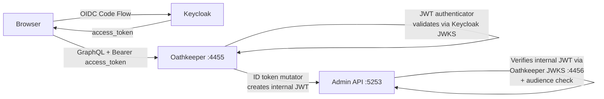
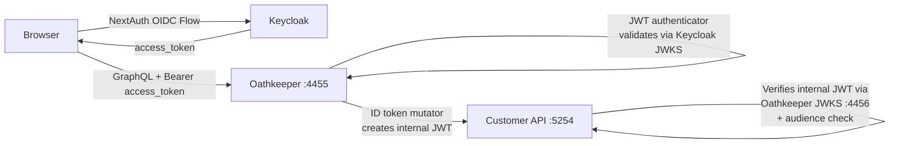

### Authentication Overview

#### Gateway and backend (Oathkeeper + Admin & Customer APIs)

- **Request routing through Oathkeeper (port 4455):**

  - Admin-panel → `admin.localhost:4455/graphql` → Admin API (port 5253)
  - Customer-portal → `app.localhost:4455/graphql` → Customer API (port 5254)

- **Oathkeeper**

  1. Validates the incoming Keycloak access token (signature + issuer) against Keycloak JWKS and trusted issuers.
  2. Issues an internal JWT (ID token) with a route‑specific audience and the user subject (e.g., Lana ID), signs it with Oathkeeper keys, and injects it into the `Authorization` header.
  3. Proxies the request to the appropriate upstream (Admin API or Customer API).

- **Backends (Admin and Customer APIs)**

  - Accepts only the internal JWT from Oathkeeper.
  - Verifies the token via the Oathkeeper JWKS on port 4456.

- **Configuration files:**
  - Route rules: `dev/ory/oathkeeper_rules.yaml`
  - Backend JWKS/audience: `dev/lana.default.yml`

#### High-level request flow (Admin-panel)

#### Admin-panel (Next.js) behavior

- Uses `keycloak-js` and a Public Client.
- Tokens are kept in memory only; Keycloak session is tracked by cookies on the Keycloak domain.
- If cookies are valid, `keycloak-js` authenticates; otherwise it redirects to the Keycloak login page. A hard refresh clears memory, but while cookies remain valid re‑auth happens silently.
- GraphQL requests include `Authorization: Bearer <access_token>` (see `apps/admin-panel/lib/apollo-client/client.tsx`).

#### High-level request flow (Customer-portal)

#### Customer-portal (Next.js + NextAuth) behavior

- Uses NextAuth with the Keycloak provider (`apps/customer-portal/auth.ts`) and a Private Client.
- NextAuth stores the Keycloak access token in the session; the RSC Apollo Client injects it as `Authorization: Bearer <access_token>` (see `apps/customer-portal/lib/apollo-client/rsc.ts`).
- Requests are sent to `app.localhost:4455/graphql` via Oathkeeper, which validates them and forwards an internal JWT to the customer API; the backend verifies via JWKS on 4456.

#### Dev login flows

- Local realms are configured with a custom "DEV browser" flow that supports email-only login (no password).
- Bats tests use the DEV direct‑grant flow (password grant) to obtain Keycloak access tokens and call GraphQL via Oathkeeper. See `bats/helpers.bash`.
- Realm definitions:
  - `dev/keycloak/internal-realm.json`
  - `dev/keycloak/customer-realm.json`

#### Backend services that manage users

- Backend services use service‑account credentials via the Rust `lib/keycloak-client` crate, which obtains admin tokens and calls the Keycloak Admin API.

### Known Issues (Local Development)
- In local dev, **Brave Browser** blocks the admin-panel login flow because the app makes a cross-site HTTP request to Keycloak.
This can be fixed by turning off Brave Shields for `admin.localhost`.

