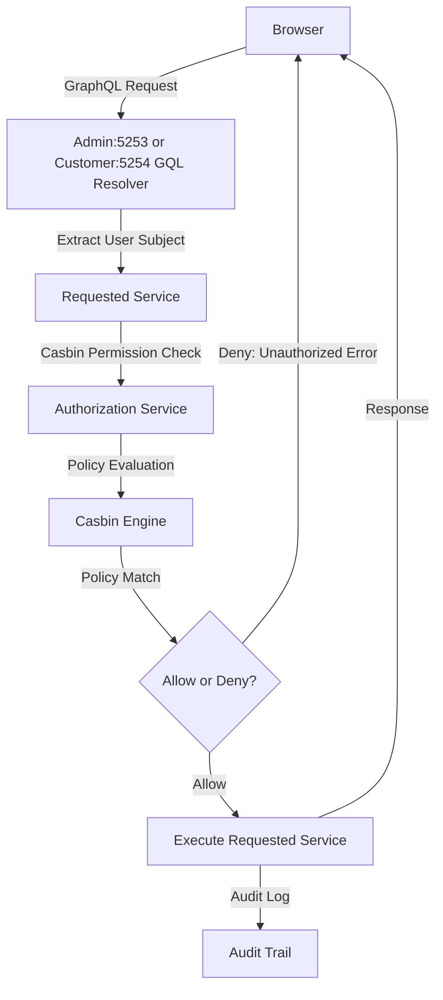

### Authorization Overview

#### Role-Based Authorization with Casbin

The Lana Bank application uses a full RBAC system with casbin authorization-engine for complex role-based permissions

**Core Components:**
- **Casbin**: Authorization engine with PostgreSQL policy storage, uses a custom RBAC model ([rbac.conf](./lib/authz/src/rbac.conf)) to match permissions against policies.
- **rbac-types**: Centralized type system for RBAC entities to generate all action-permission mappings ([rbac-types](./lana/rbac-types/src))
- **authz**: Casbin wrapper with audit integration ([authz](./lib/authz/src))

**Key Concepts:**
- **Subject**: Admin user, Customer or System performing the action (e.g., `user:123e4567-e89b-12d3-a456-426614174000` - a specific admin user identified by UUID)
- **Object**: Resource being accessed with domain (module) prefix (e.g., `credit/credit-facility/*` - all credit facilities, part of `credit` domain)
- **Action**: Operation being performed with domain (module) prefix (e.g., `credit:credit-facility:create` - creating new credit facility, part of `credit` domain)
- **Permission Set**: Named collection of related individual permissions (e.g., `credit_writer` - includes `CreditFacilityAction::Create`, `DisbursalAction::Initiate`, etc.). Each action maps to a specific permission to define what operations require which permissions.
- **Role**: A group of permission sets assigned to users (e.g., `bank-manager` - combines multiple permission sets like `credit_writer`, `customer_viewer`, etc.)

**Example Mapping**: `user:123e4567-e89b-12d3-a456-426614174000` (bank manager Alice) → `bank-manager` role → `credit_writer` permission set (inherited by the role) → can perform `credit:credit-facility:create` action on `credit/credit-facility/*` objects

Alice gets the `credit_writer` permission set because her `bank-manager` role inherits it. This allows her to create credit facilities across all credit facility resources.

### High-level authorization flow

- **Policy Storage**: Casbin policies stored in PostgreSQL `casbin_rule` table
- **Bootstrap Initialization**: Initial policies, roles and action-permission mappings are generated from code definitions during system bootstrap ([bootstrap](./core/access/src/bootstrap.rs))
- **Dynamic Policy Generation**: New policies and roles can be created, modified, or removed at runtime.
- **Permission-scoped visibility**: The admin dashboard dynamically adjusts item visibility according to individual user permissions.

##### Browser <-> Server Flow

- Browser sends GraphQL query/mutation with JWT
- GraphQL resolver extracts user subject from JWT token
- Requested service calls the authorization service with (subject, object, action)
- Casbin policy engine evaluates user's role permissions against policies for the role/permissions sets
- The audit service logs authorization decision (allow/deny)
- Returns the result or authorization error

### Casbin Policy Model Overview

#### Database Schema

Casbin stores all rules as **strings** in a flexible schema in the `casbin_rule` table:
All matching operates on **string comparison** and **pattern matching**.
Rules reference entities using **`name:UUID`** format (e.g., `role:UUID`, `permission_set:UUID`) that correspond to actual database tables.

### Rule Types

#### Policy Rules (`p`)

**Format:** `p = sub, obj, act`  
Defines **what permissions exist**: permission sets can perform specific actions on resource patterns.

**Example:** `permission_set:reports` can perform `read` on `report/finance/*`

#### Grouping Rules (`g`)

**Format:** `g = _, _`  
Defines **inheritance relationships**: creates hierarchical chains like `user` → `role` → `permission_set`.

**Example:** `user:alice` inherits from `role:manager` or `role:manager` inherits from `permission_set:reports`

### Access Control Flow

#### Request Format

**Definition:** `r = sub, obj, act`  
Represents a user (`sub`) requesting to perform an action (`act`) on a specific resource (`obj`).

#### Matching Process

**Matcher:** `g(r.sub, p.sub) && keyMatch(r.obj, p.obj) && r.act == p.act`

1. **Inheritance Check:** Recursively verifies across the permission sets that the user inherits via the role
2. **Resource Match:** Pattern-based matching with wildcard support
3. **Action Match:** Exact string equality for actions

#### Authorization Result

Access is **granted** only when all three string-based conditions are satisfied, creating a secure and flexible role-based access control system.
