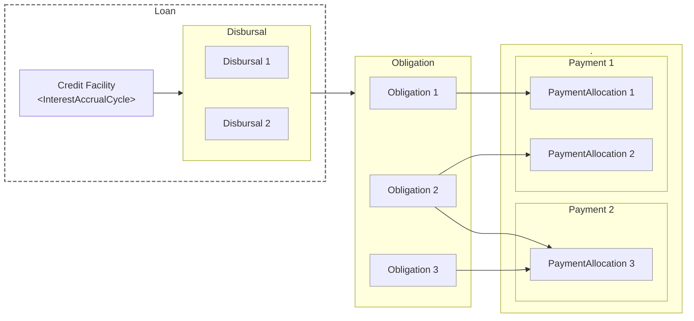

## Credit Module Lifecycle

> A [`CreditFacility`](./facility/) advances funds to a borrower through one or more [`Disbursals`](./disbursal/).
  Each disbursal creates corresponding [`Obligations`](./obligation/) (for *Principal* or any *Accrued Interest*) that the borrower must repay.
  When the borrower makes a [`Payment`](./payment/), it is allocated to specific obligations via [`PaymentAllocation`](./payment/#payment-allocation) records.
  [`Terms`](./terms/) define the interest rates, schedules and other rules that govern the facility and its obligations.
  Once every obligation is fully satisfied, the credit facility is automatically closed.
