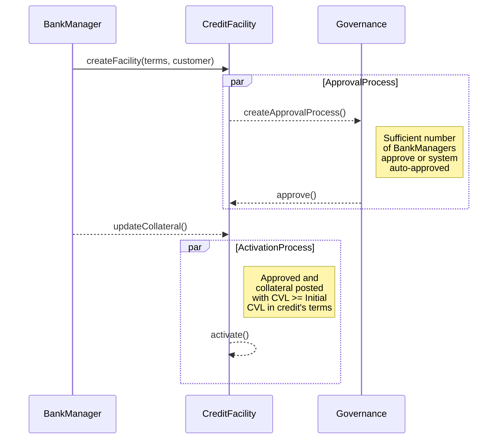

## Credit Facility

A `CreditFacility` is a legally binding lending agreement between a bank and a customer that establishes a maximum credit limit the bank is willing to extend.

It specifies:

1. **Credit Limit** - The *maximum* amount of credit available to the customer.
2. **Loan Terms** - Details such as interest rates, fees, and risk parameters.
3. **Maturity Provisions** - Details when the credit facility will mature or expire.
4. **Repayment Schedule** - The timeline and conditions under which the customer must repay the borrowed amount and any accrued interest.

In our domain model, a `CreditFacility` is the central entity that manages the lifecycle of credit, including disbursals, obligations, and payments.
We have `InterestAccrualCycle` to manage the interest accrual process, which is crucial for calculating the interest on the disbursed amounts.

#### Facility Approval & Activation

A `CreditFacility` goes through an approval process where it is created by a bank manager and then submitted to governance module. The governance module defines the rules for approval, which can be manual (requiring a certain number of approvals from bank users) or automatic (system auto-approved).

Activation of a `CreditFacility` can happen only after `Collateral` for the Facility has been posted and the `CreditFacility` is approved by the governance process.
Collateral's CVL should be more than initial CVL as defined in the `CreditFacility` terms for the facility to activate.

Upon activation of the facility, `InterestAccrualCycle` is initialized to start accruing interest on disbursed amounts.
